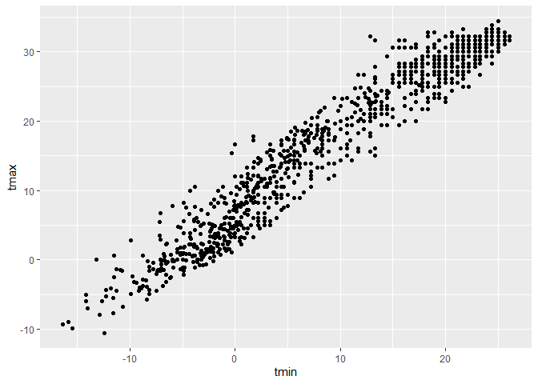
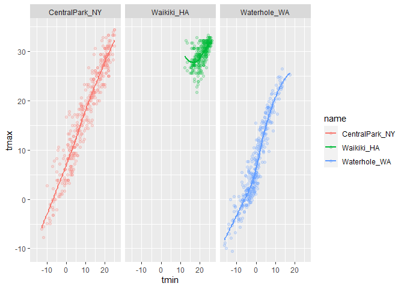
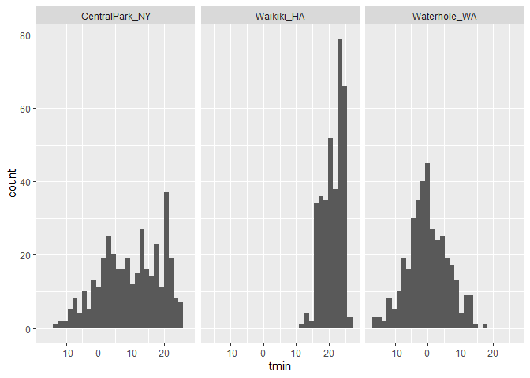
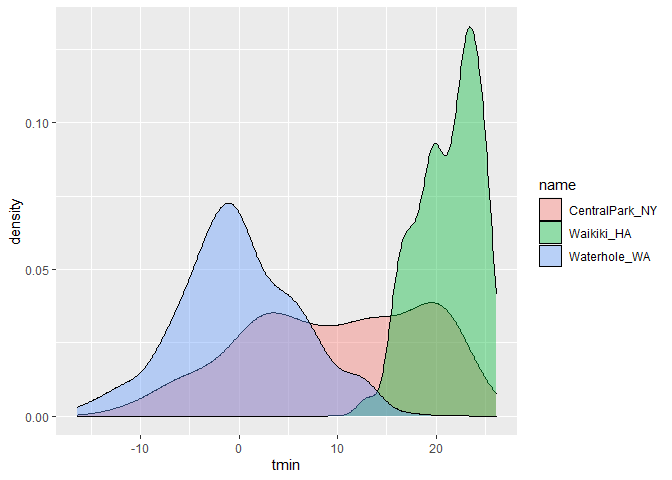
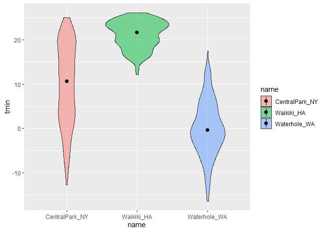

Visualization
================

``` r
library(tidyverse)
```

    ## -- Attaching packages -------------------

    ## v ggplot2 3.3.2     v purrr   0.3.4
    ## v tibble  3.0.3     v dplyr   1.0.2
    ## v tidyr   1.1.2     v stringr 1.4.0
    ## v readr   1.3.1     v forcats 0.5.0

    ## -- Conflicts --- tidyverse_conflicts() --
    ## x dplyr::filter() masks stats::filter()
    ## x dplyr::lag()    masks stats::lag()

``` r
library(ggridges)
```

## Load the weather data

rnoaa lets you access public data online; telling R we want data from
these three weather stations.

Mutate to rename variables for weather station.

``` r
weather_df = 
  rnoaa::meteo_pull_monitors(
    c("USW00094728", "USC00519397", "USS0023B17S"),
    var = c("PRCP", "TMIN", "TMAX"), 
    date_min = "2017-01-01",
    date_max = "2017-12-31") %>%
  mutate(
    name = recode(
      id, 
      USW00094728 = "CentralPark_NY", 
      USC00519397 = "Waikiki_HA",
      USS0023B17S = "Waterhole_WA"),
    tmin = tmin / 10,
    tmax = tmax / 10) %>%
  select(name, id, everything())
```

    ## Registered S3 method overwritten by 'hoardr':
    ##   method           from
    ##   print.cache_info httr

    ## using cached file: C:\Users\hbrig\AppData\Local\Cache/R/noaa_ghcnd/USW00094728.dly

    ## date created (size, mb): 2020-10-05 18:45:50 (7.537)

    ## file min/max dates: 1869-01-01 / 2020-10-31

    ## using cached file: C:\Users\hbrig\AppData\Local\Cache/R/noaa_ghcnd/USC00519397.dly

    ## date created (size, mb): 2020-10-05 18:46:09 (1.703)

    ## file min/max dates: 1965-01-01 / 2020-03-31

    ## using cached file: C:\Users\hbrig\AppData\Local\Cache/R/noaa_ghcnd/USS0023B17S.dly

    ## date created (size, mb): 2020-10-05 18:46:18 (0.882)

    ## file min/max dates: 1999-09-01 / 2020-10-31

## Scatterplot

``` r
ggplot(weather_df, aes(x = tmin, y = tmax)) +
  geom_point()
```

    ## Warning: Removed 15 rows containing missing values (geom_point).

<!-- -->

New approach, same plot

``` r
weather_df %>% 
  ggplot(aes(x = tmin, y = tmax))+
  geom_point()
```

    ## Warning: Removed 15 rows containing missing values (geom_point).

<!-- -->

Save and edit plot object

``` r
weather_plot = 
  weather_df %>% 
  ggplot(aes(x = tmin, y = tmax))

weather_plot + geom_point()
```

    ## Warning: Removed 15 rows containing missing values (geom_point).

<!-- -->

## Advnaced scatter plot

``` r
weather_df %>% 
  ggplot(aes(x = tmin, y = tmax, color = name)) + 
  geom_point() + 
  geom_smooth(se = FALSE)
```

    ## `geom_smooth()` using method = 'loess' and formula 'y ~ x'

    ## Warning: Removed 15 rows containing non-finite values (stat_smooth).

    ## Warning: Removed 15 rows containing missing values (geom_point).

<!-- -->

What about the `aes` placement?

``` r
weather_df %>% 
  ggplot(aes(x = tmin, y = tmax)) + 
  geom_point(aes(color = name)) +
  geom_smooth()
```

    ## `geom_smooth()` using method = 'gam' and formula 'y ~ s(x, bs = "cs")'

    ## Warning: Removed 15 rows containing non-finite values (stat_smooth).

    ## Warning: Removed 15 rows containing missing values (geom_point).

<!-- -->

Let’s facet some things

``` r
weather_df %>% 
  ggplot(aes(x = tmin, y = tmax, color = name)) + 
  geom_point(alpha = 0.2) + 
  geom_smooth(se = FALSE) +
  facet_grid(. ~ name)
```

    ## `geom_smooth()` using method = 'loess' and formula 'y ~ x'

    ## Warning: Removed 15 rows containing non-finite values (stat_smooth).

    ## Warning: Removed 15 rows containing missing values (geom_point).

<!-- -->

Combine some elements, new plot

``` r
weather_df %>% 
  ggplot(aes(x = date, y = tmax, color = name)) +
  geom_point(aes(size = prcp), alpha = 0.5) +
  geom_smooth(se = FALSE)+
  facet_grid(. ~ name)
```

    ## `geom_smooth()` using method = 'loess' and formula 'y ~ x'

    ## Warning: Removed 3 rows containing non-finite values (stat_smooth).

    ## Warning: Removed 3 rows containing missing values (geom_point).

<!-- -->

## Small notes

How many geoms have to exist?

Whatever geoms you want

``` r
weather_df %>% 
  ggplot(aes(x = tmin, y = tmax, color = name))+
  geom_smooth(se = FALSE)
```

    ## `geom_smooth()` using method = 'loess' and formula 'y ~ x'

    ## Warning: Removed 15 rows containing non-finite values (stat_smooth).

<!-- -->

A neat geom\!

``` r
weather_df %>%
  ggplot(aes(x = tmin, y = tmax))+
  geom_density2d()+
  geom_point(alpha = 0.3)
```

    ## Warning: Removed 15 rows containing non-finite values (stat_density2d).

    ## Warning: Removed 15 rows containing missing values (geom_point).

<!-- -->

## Univariate plots

Histograms

``` r
weather_df %>% 
  ggplot(aes(x = tmin)) +
  geom_histogram()
```

    ## `stat_bin()` using `bins = 30`. Pick better value with `binwidth`.

    ## Warning: Removed 15 rows containing non-finite values (stat_bin).

<!-- -->

Can you add color?

``` r
weather_df %>% 
  ggplot(aes(x = tmin)) +
  geom_histogram() + 
  facet_grid(. ~ name)
```

    ## `stat_bin()` using `bins = 30`. Pick better value with `binwidth`.

    ## Warning: Removed 15 rows containing non-finite values (stat_bin).

<!-- -->

Let’s try a new geom

``` r
weather_df %>% 
  ggplot(aes(x = tmin, fill = name)) +
  geom_density(alpha = 0.4)
```

    ## Warning: Removed 15 rows containing non-finite values (stat_density).

<!-- -->

What about box plots?

``` r
weather_df %>% 
  ggplot(aes(x = name, y = tmin))+
  geom_boxplot()
```

    ## Warning: Removed 15 rows containing non-finite values (stat_boxplot).

<!-- -->

Trendy plots

``` r
weather_df %>% 
  ggplot(aes(x = name, y = tmin, fill = name)) + 
  geom_violin(alpha = 0.5)+
  stat_summary(fun = "median")
```

    ## Warning: Removed 15 rows containing non-finite values (stat_ydensity).

    ## Warning: Removed 15 rows containing non-finite values (stat_summary).

    ## Warning: Removed 3 rows containing missing values (geom_segment).

<!-- -->

Ridge plot

``` r
weather_df %>% 
  ggplot(aes(x = tmin, y = name))+
  geom_density_ridges()
```

    ## Picking joint bandwidth of 1.67

    ## Warning: Removed 15 rows containing non-finite values (stat_density_ridges).

<!-- -->

## save and embed plots

Save a scatter plot

``` r
weather_plot =
  weather_df %>% 
    ggplot(aes(x = tmin, y = tmax, color = name))+
    geom_point(alpha = 0.5)

ggsave("weather_plot.pdf", weather_plot, width = 8, height = 5)
```

    ## Warning: Removed 15 rows containing missing values (geom_point).

What about embedding

``` r
weather_plot
```

    ## Warning: Removed 15 rows containing missing values (geom_point).

<!-- -->

``` r
weather_plot
```

    ## Warning: Removed 15 rows containing missing values (geom_point).

<!-- -->
