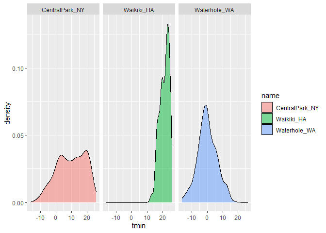

Visualization, Part 2
================

``` r
library(tidyverse)
```

    ## -- Attaching packages ------------------ tidyverse 1.3.0 --

    ## v ggplot2 3.3.2     v purrr   0.3.4
    ## v tibble  3.0.3     v dplyr   1.0.2
    ## v tidyr   1.1.2     v stringr 1.4.0
    ## v readr   1.3.1     v forcats 0.5.0

    ## -- Conflicts --------------------- tidyverse_conflicts() --
    ## x dplyr::filter() masks stats::filter()
    ## x dplyr::lag()    masks stats::lag()

``` r
library(patchwork)
```

## Load the weather data

``` r
weather_df = 
  rnoaa::meteo_pull_monitors(
    c("USW00094728", "USC00519397", "USS0023B17S"),
    var = c("PRCP", "TMIN", "TMAX"), 
    date_min = "2017-01-01",
    date_max = "2017-12-31") %>%
  mutate(
    name = recode(
      id, 
      USW00094728 = "CentralPark_NY", 
      USC00519397 = "Waikiki_HA",
      USS0023B17S = "Waterhole_WA"),
    tmin = tmin / 10,
    tmax = tmax / 10) %>%
  select(name, id, everything())
```

    ## Registered S3 method overwritten by 'hoardr':
    ##   method           from
    ##   print.cache_info httr

    ## using cached file: C:\Users\hbrig\AppData\Local\Cache/R/noaa_ghcnd/USW00094728.dly

    ## date created (size, mb): 2020-10-05 18:45:50 (7.537)

    ## file min/max dates: 1869-01-01 / 2020-10-31

    ## using cached file: C:\Users\hbrig\AppData\Local\Cache/R/noaa_ghcnd/USC00519397.dly

    ## date created (size, mb): 2020-10-05 18:46:09 (1.703)

    ## file min/max dates: 1965-01-01 / 2020-03-31

    ## using cached file: C:\Users\hbrig\AppData\Local\Cache/R/noaa_ghcnd/USS0023B17S.dly

    ## date created (size, mb): 2020-10-05 18:46:18 (0.882)

    ## file min/max dates: 1999-09-01 / 2020-10-31

Revisit plot for part 1 of session.

``` r
weather_df %>% 
  ggplot(aes(x = tmin, y = tmax, color = name)) + 
  geom_point(alpha = .5)
```

    ## Warning: Removed 15 rows containing missing values (geom_point).

<!-- -->

## Labels

``` r
weather_df %>% 
  ggplot(aes(x = tmin, y = tmax, color = name)) + 
  geom_point(alpha = .5) + 
  labs(
  title = "Temp Plot",
  x = "Min Temp",
  y = "Max Temp",
  caption = "data from rnoaa package 2017"
  )
```

    ## Warning: Removed 15 rows containing missing values (geom_point).

<!-- -->

## Scales

X and Y scales

``` r
weather_df %>% 
  ggplot(aes(x = tmin, y = tmax, color = name)) + 
  geom_point(alpha = .5) + 
  labs(
  title = "Temp Plot",
  x = "Min Temp",
  y = "Max Temp",
  caption = "data from rnoaa package 2017"
  ) +
  scale_x_continuous(
    breaks = c(-15, 0, 15),
    labels = c("-15 C", "0", "15 C")
  ) +
  scale_y_continuous(
    position = "right"
  )
```

    ## Warning: Removed 15 rows containing missing values (geom_point).

<!-- -->

Color scales

``` r
weather_df %>% 
  ggplot(aes(x = tmin, y = tmax, color = name)) + 
  geom_point(alpha = .5) + 
  labs(
  title = "Temp Plot",
  x = "Min Temp",
  y = "Max Temp",
  caption = "data from rnoaa package 2017"
  ) +
  viridis::scale_color_viridis(
    name = "location",
        discrete = TRUE)
```

    ## Warning: Removed 15 rows containing missing values (geom_point).

<!-- -->

## Themes

Shift the legend

``` r
weather_df %>% 
  ggplot(aes(x = tmin, y = tmax, color = name)) + 
  geom_point(alpha = .5) + 
  labs(
  title = "Temp Plot",
  x = "Min Temp",
  y = "Max Temp",
  caption = "data from rnoaa package 2017"
  ) +
  viridis::scale_color_viridis(
    name = "location",
        discrete = TRUE) +
  theme(legend.position = "bottom")
```

    ## Warning: Removed 15 rows containing missing values (geom_point).

<!-- -->

Change overall theme

``` r
weather_df %>% 
  ggplot(aes(x = tmin, y = tmax, color = name)) + 
  geom_point(alpha = .5) + 
  labs(
  title = "Temp Plot",
  x = "Min Temp",
  y = "Max Temp",
  caption = "data from rnoaa package 2017"
  ) +
  viridis::scale_color_viridis(
    name = "location",
        discrete = TRUE) + 
  theme_minimal()
```

    ## Warning: Removed 15 rows containing missing values (geom_point).

<!-- -->

## Setting options

``` r
library(tidyverse)

knitr::opts_chunk$set(
  fig.width = 6,
  fig.asp = 0.6,
  out.width = "90%"
)

theme_set(theme_minimal() + theme(legend.position = "bottom"))

options(
  ggplot2.continuous.colour = "viridis",
  ggplot2.continuous.fill = "viridis"
)

scale_color_discrete = scale_color_viridis_d
scale_fill_discrete = scale_fill_viridis_d
```

## Data args in `geom`

``` r
central_park = 
    weather_df %>% 
  filter(name == "CentralPark_NY")

waik = 
  weather_df %>% 
  filter(name == "Waikiki_HA")

ggplot(data = waik, aes(x = date, y = tmax, color = name))+
  geom_point()+
  geom_line(data = central_park)
```

    ## Warning: Removed 3 rows containing missing values (geom_point).

<!-- -->

## Patchwork

Remember faceting?

``` r
weather_df %>% 
  ggplot(aes(x = tmin, fill = name)) +
  geom_density(alpha = 0.5) +
  facet_grid(. ~ name)
```

    ## Warning: Removed 15 rows containing non-finite values (stat_density).

<!-- -->

what happens when you want multipanel plots but can’t facet?

``` r
tmax_tmin_plot =
  weather_df %>% 
    ggplot(aes(x = tmin, y = tmax, color = name)) +
    geom_point(alpha = 0.5) +
    theme(legend.position = "none")

prcp_dens_plot = 
  weather_df %>% 
  filter(prcp > 0) %>% 
  ggplot(aes(x = prcp, fill = name)) +
  geom_density(alpha = 0.5)+
  theme(legend.position = "none")

tmax_dates_plot = 
  weather_df %>% 
  ggplot(aes(x = date, y = tmax, color = name)) +
  geom_point() + 
  geom_smooth(se = FALSE) +
  theme(legend.position = "none")

(tmax_tmin_plot + prcp_dens_plot) / tmax_dates_plot
```

    ## Warning: Removed 15 rows containing missing values (geom_point).

    ## `geom_smooth()` using method = 'loess' and formula 'y ~ x'

    ## Warning: Removed 3 rows containing non-finite values (stat_smooth).

    ## Warning: Removed 3 rows containing missing values (geom_point).

<!-- -->
